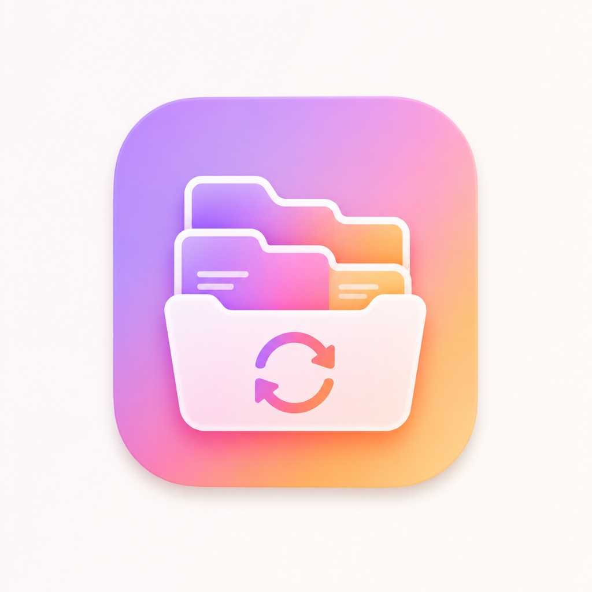

<div align="center">
  
  <h1>Organizer</h1>
  <p><strong>A powerful, automated, and cross-platform desktop file organizer for macOS & Windows.</strong></p>
</div>

<br />

## 🌟 Overview

**Organizer** is a smart desktop application designed to keep your workspace clutter-free. Simply designate folders to "watch", and the app will automatically organize incoming files into categorized subfolders based on a robust set of rules. It runs silently as a background daemon, ensuring your files are managed without disrupting your workflow.

## ✨ Key Features

- **⚡ Real-Time File Organization**: Automatically detects and moves new files in your watched folders using `chokidar`.
- **🧠 Deep File Type Inspection**: Doesn't just rely on extensions! Reads the binary magic numbers (first 16 bytes) of a file to correctly identify and organize images, videos, documents, and archives even if their extensions are missing or spoofed.
- **🗂️ File De-duplication Engine**: Safely scans your folders to find exact duplicates by comparing byte sizes and generating SHA-256 content hashes. Allows you to seamlessly move duplicates into a dedicated cleanup folder to reclaim disk space.
- **⚙️ Advanced Rule Engine**: Create powerful custom rules based on exact extensions, broad type groups (Images, Code, Audio), filename patterns (regex/glob), or file sizes. Supports AND/OR logic.
- **👻 True Background Mode**: Runs completely headless. When the main window is closed, Organizer disappears from your Dock/Taskbar and continues working silently from your System Tray.
- **🎨 Premium Dark UI**: A sleek, pitch-black aesthetic with high-contrast borders and smooth micro-animations.

## 🛠️ Tech Stack

- **Framework**: Electron + Vite
- **Frontend**: React 18 + TypeScript + Vanilla CSS
- **Storage**: `electron-store` (Persistent local JSON storage)
- **File System**: Node.js `fs`, `path`, `crypto`
- **Packaging**: `electron-builder`

## 🚀 Getting Started

### Prerequisites
- Node.js (v18 or higher recommended)
- npm or yarn

### Installation

1. **Clone the repository**
   ```bash
   git clone https://github.com/parassawal/Organizer.git
   cd Organizer
   ```

2. **Install dependencies**
   ```bash
   npm install
   ```

3. **Run in Development Mode**
   ```bash
   npm run dev
   ```

### Building for Production

**For macOS:**
```bash
npm run dist:mac
```
*The output `.dmg` and `.zip` will be located in the `dist/` folder.*

**For Windows:**
```bash
npm run dist:win
```
*The output setup `.exe` will be located in the `dist/` folder.*

## 💡 How It Works

1. **Add a Watched Folder**: Select any directory on your computer (e.g., `Downloads` or `Desktop`).
2. **Set Rules**: The app comes with 6 default smart rules (Images, Videos, Music, Documents, Archives, Code). You can customize these or build your own.
3. **Let It Run**: As soon as a file lands in a watched folder, Organizer identifies it, checks your rules by priority, and moves it into the correct subfolder (e.g., `Downloads/Images/`).

## 🤝 Contributing
Contributions, issues, and feature requests are welcome! Feel free to check the [issues page](https://github.com/parassawal/Organizer/issues).

## 📝 License
This project is licensed under the MIT License.
